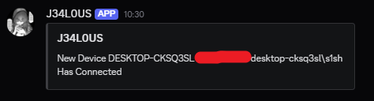
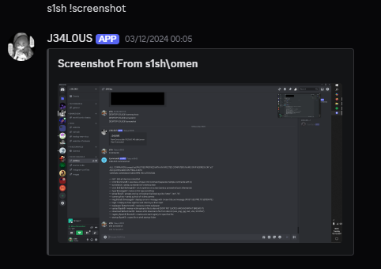
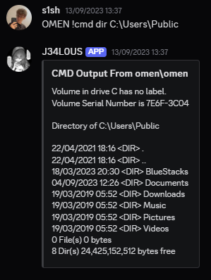
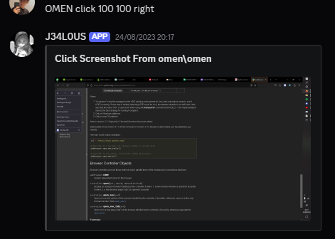
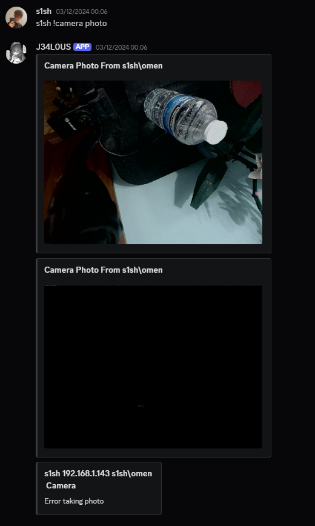

# J34L0US

This is a RAT programmed entirely in python, which is controlled through a chosen channel ID on Discord. The program runs a discord bot locally on the device which listens for commands and outputs accordingly.

## Features
- "list" shows all connected instances of the bot
- "cmd $command$" executes a local cmd script and sends output to discord
- "screenshot" sends a screenshoot of connected devices screen
- "click $x$ $y$ $left/right$" clicks on the screen at given coordinates and returns a screenshot
- "type $message$" forces the device to type given input and returns screenshot
- "press $key$" presses a single key on the keyboard (including "enter", "win", "d")
- "camera photo" takes a photo through available cameras and returns to Discord
- "msg $title$ | $message$" creates popup window with given values
- "login" creates a fake windows login screen and returns the users input
- "wallpaper $attachment$" replaces the wallpaper on the device with uploaded attachment
- "upload $path$" uploads given path to Discord from instance
- "download $attachment$" makes instance download given file
- "registry $path$ | $name$" creates startup registry for specified path
- "startup $path$" adds given path to startup

## How To Use
**DO NOT RUN THIS PROGRAM ON ANY DEVICE WITHOUT PERMISSION**
It's not recommended to run this program on any devices.
To run this program, the channel the bot uses needs to be defined and the bot needs to be initialised with its own token.
(I've removed both the channelId and bot token from this source code)

## Screenshots
**Device Connected**

**Device Screenshot**

**Device CMD**

**Device Click**

**Device Camera**

